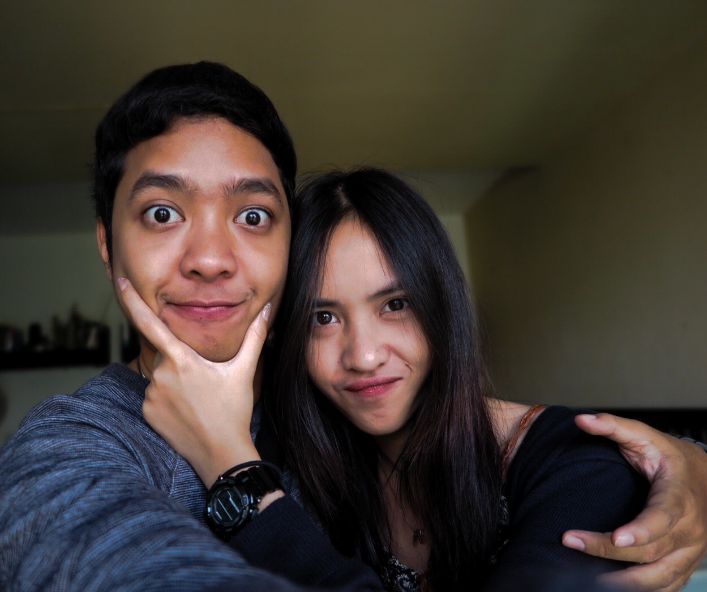
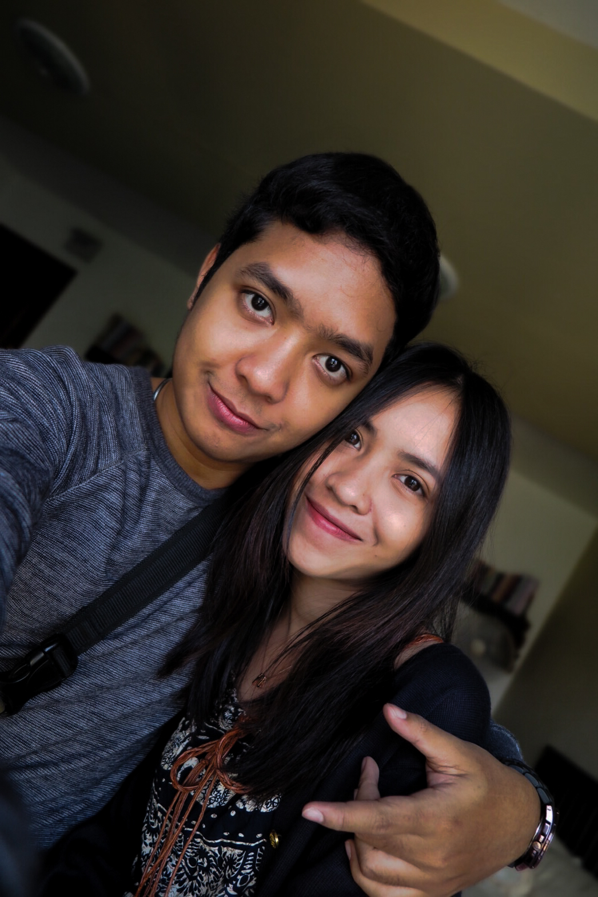
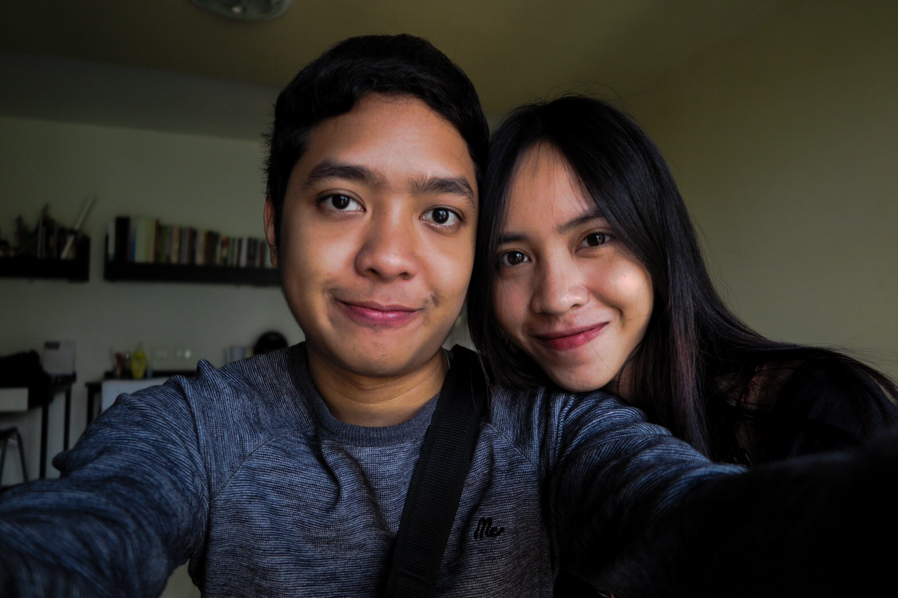
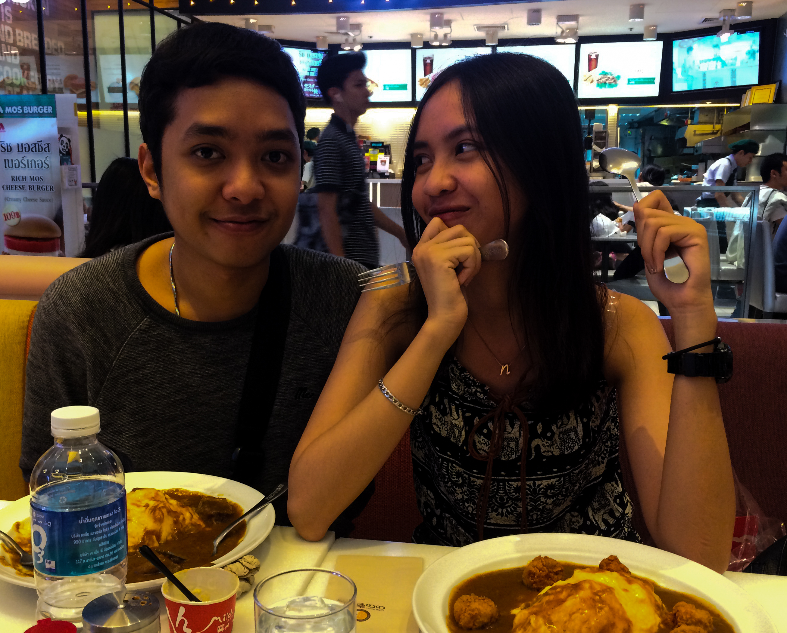
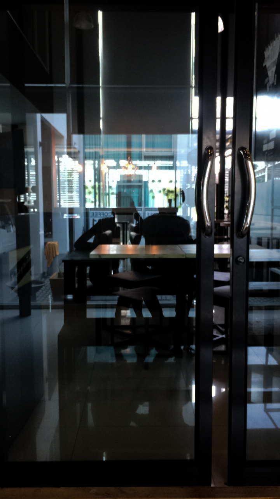
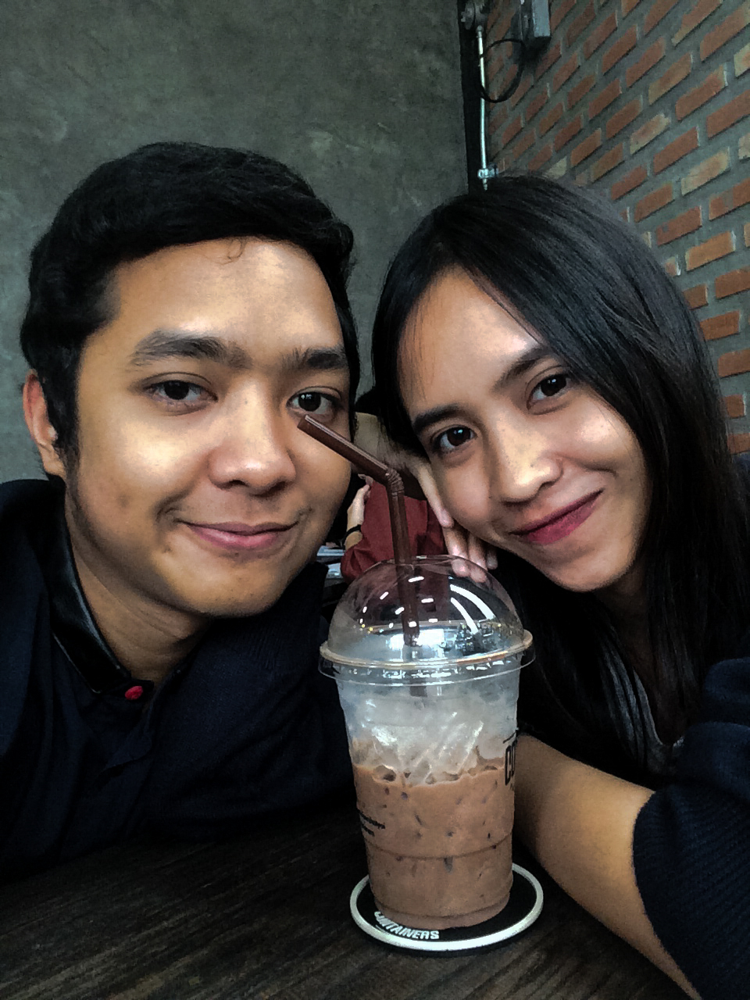
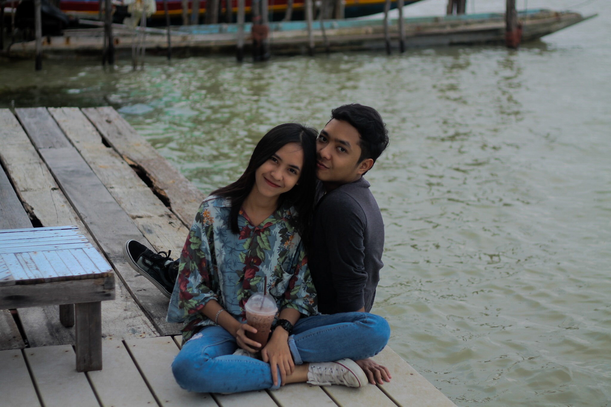

<!DOCTYPE html>
<html>
<title>W3.CSS Template</title>
<meta charset="UTF-8">
<meta name="viewport" content="width=device-width, initial-scale=1">
<link rel="stylesheet" href="w3.css">
<link rel="stylesheet" href="https://fonts.googleapis.com/css?family=Raleway">
<link rel="stylesheet" href="https://cdnjs.cloudflare.com/ajax/libs/font-awesome/4.7.0/css/font-awesome.min.css">

<body>

  

    <h1 class="w3-jumbo w3-animate-top">PHOTOGRAPHER</h1>
    

    
09-01-2017

  

</style>
<body>

<!-- !PAGE CONTENT! -->

<!-- Header -->
<header class="w3-panel w3-center w3-opacity" style="padding:128px 16px">
  <h1 class="w3-xlarge">BRAIN & NUNU</h1>
  
  
</header>

<!-- Photo Grid -->

  

	
    
    
    
    
    
    
    
  

  

    
    
    
    
    
    
  

  
<!-- End Page Content -->

</body>
</html>
